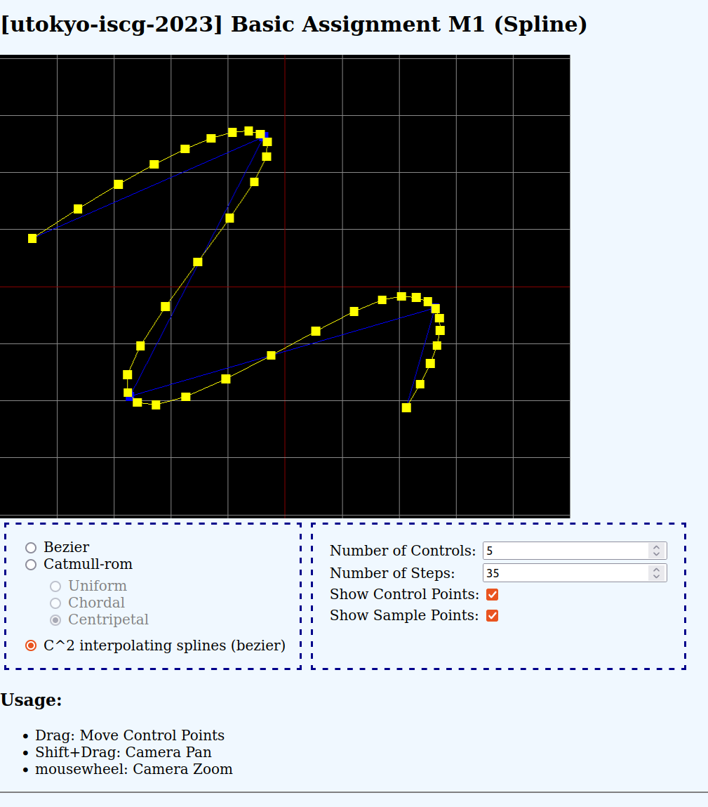

# 本リポジトリについて

`cg2023`は、コンピュータグラフィックス論(2023年度)の課題置き場です。

# 動かし方

トップのディレクトリで次のコマンドを実行します:

```shell
npm install  # 依存関係のインストール
npm run dev
```

標準出力に出力されたURLにアクセスします。

または、`npm run build`としてビルドし、出力されたHTMLファイルを見る方法もあります。

# 概観


